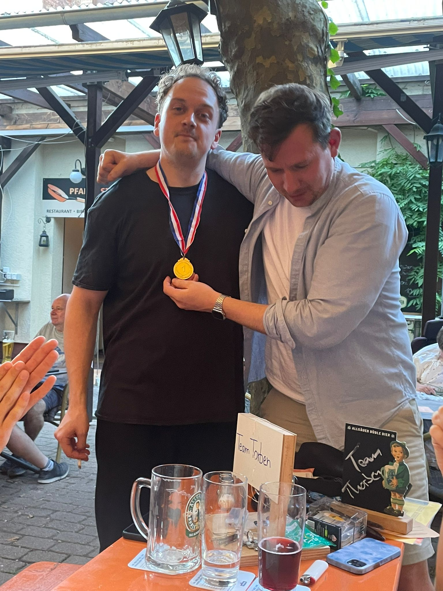

Diese Woche stand ein besonders spannendes Quiz an, weil unser Teammitglied Alex diese Woche der Quizmeister war. Doch bevor es zu seinem Quiz kam, galt es zuerst, die Sieger unseres Tippspiels zur Fußball-Europameisterschaft zu ehren. Den ersten Rang mit beeindruckenden 113 Punkten erreichte Jonas, der sich knapp vor Ruben mit 111 Punkten behauptete und ihn am letzten Spieltag überholte. Tobi schaffte es auf Platz 3 mit respektablen 102 Punkten.

Dann kam der Moment der Wahrheit. 
Unter dem Vorsitz von Constantin gaben Jan, Thorben und Jonas ihr Bestes, um möglichst gut abzuschneiden. 
Die ersten Fragen drehten sich um Ereignisse aus den 2000er-Jahren, was uns einige nostalgische Momente und auch ein paar "Ach ja, das war damals"-Momente bescherte. 
Dann kam die Mathefrage, bei der wir kurzzeitig dachten, wir hätten uns ins falsche Quiz verirrt – die Köpfe rauchten mehr als der Grill beim letzten Sommerfest.

Anschließend mussten Bösewichte identifiziert und Fragen zu ihnen beantwortet werden – hier fühlten wir uns fast wie in einem James-Bond-Film, nur ohne die schicken Anzüge und Gadgets. 
Dann galt es, auf einer Karte die markierten Länder zu erkennen und deren Hauptstadt zu nennen. 
Es stellte sich heraus, dass unser geographisches Wissen manchmal etwas... sagen wir mal... lückenhaft war. 
Gefolgt von der Herausforderung, vorgegebene Sehenswürdigkeiten den richtigen Ländern zuzuordnen, was eher einer geographischen Schnitzeljagd ähnelte, bei der wir ab und zu in die falsche Richtung liefen.

Zum Schluss warteten noch einige Fragen, die unser Allgemeinwissen auf die Probe stellten. 
Insgesamt schlugen wir uns gut und konnten bei den meisten Fragen zuverlässig antworten. 
Doch hier und da hatten wir Probleme und mussten Punkte liegen lassen – unser innerer Sheldon Cooper war wohl gerade in der Mittagspause.

Am Ende erreichten wir mit 39,5 von 50 Punkten nur den zweiten Platz. 
Aber hey, wer will schon immer Erster sein? 
Zweiter Platz bedeutet, dass wir immer noch hungrig sind – und weniger Verpflichtungen beim Siegerschnaps haben. 
Nächste Woche greifen wir wieder an – mit neuen Taktiken, schärferem Verstand und vielleicht einem oder zwei Glückskeksen mehr in der Tasche!